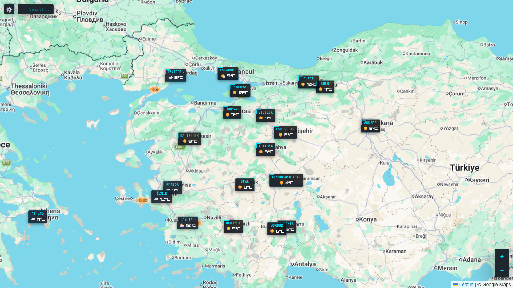

# WorldWeatherMonitor 🌍

An interactive world weather map that displays real-time weather conditions for cities around the globe. Click any city marker to view detailed forecasts including hourly and 7-day predictions, animated weather conditions, and air quality data. Search for any location using the built-in search bar.

**🔗 Live Demo: [https://world-weather-monitor.vercel.app](https://world-weather-monitor.vercel.app)**



## Getting Started

```bash
git clone https://github.com/bariskisir/WorldWeatherMonitor.git
cd WorldWeatherMonitor
npm run dev
```

Open [http://localhost:3000](http://localhost:3000) in your browser.

## License

MIT

## Known Issues

- Some city/province locations may be missing from the database or incorrectly defined. Geographic data is provided as-is and may not be 100% accurate or exhaustive.
